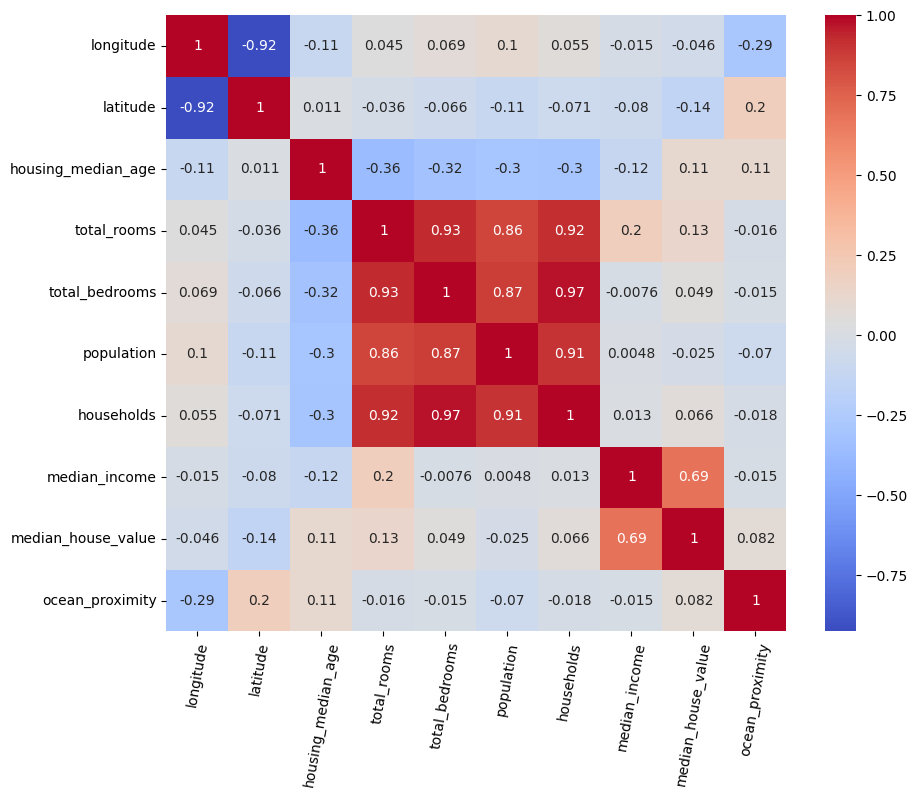
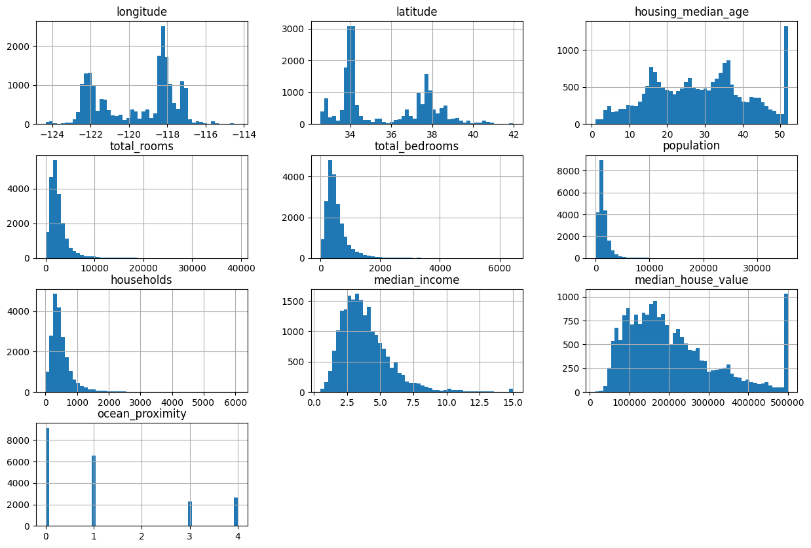
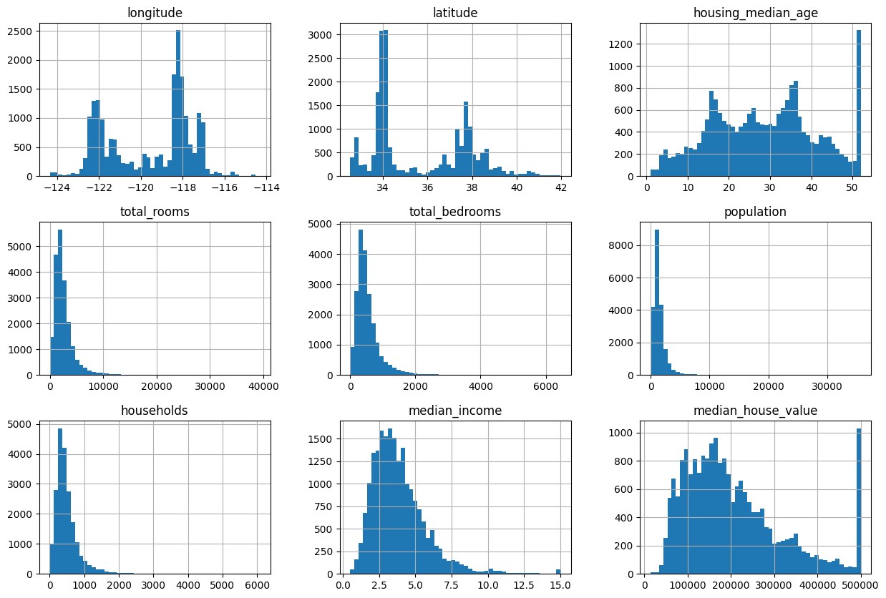
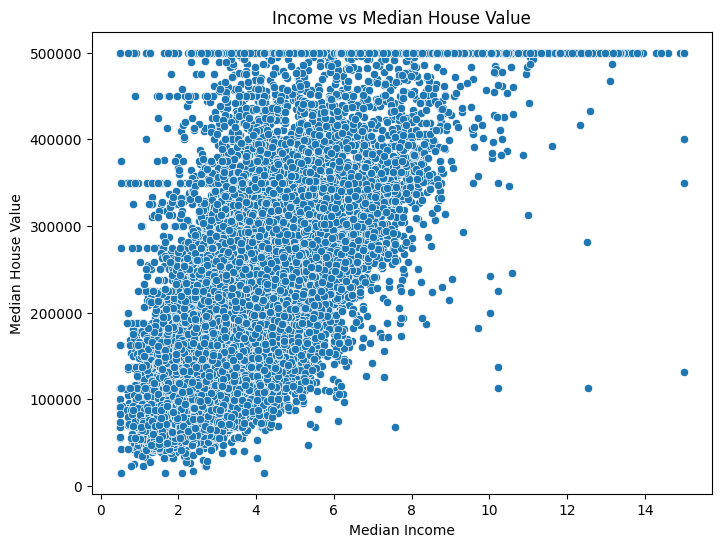

# Housing Market Analysis 🏠

## 📊 Overview
This project analyzes housing data to explore property prices and identify key factors affecting housing values.

## 🛠️ Tools
- Python (Pandas, NumPy)
- Matplotlib, Seaborn
- Google Colab

## 🔍 Steps
- Data Cleaning  
- Exploratory Data Analysis (EDA)  
- Data Visualization  

## 📈 Key Insights
- Property size has a strong positive relationship with price  
- Location significantly impacts housing prices  
- More bedrooms and bathrooms generally increase property value  
- Price distribution varies across different property types  

## 🚀 How to Run
- Open the notebook in Google Colab or Jupyter Notebook  
- Run all cells  

## 📊 Results

### 📊 Housing Correlation Matrix

### 📈 Housing Features Distribution (1)

### 📉 Housing Features Distribution (2)

### 💰 Income vs House Value

